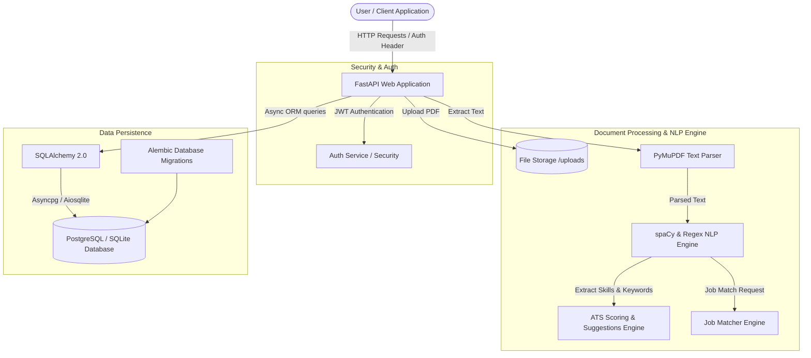

# 🚀 Resume Analyzer API

[](https://www.python.org/)
[](https://fastapi.tiangolo.com/)
[](https://www.postgresql.org/)
[](https://www.docker.com/)
[](LICENSE)

A production-ready **Resume Analyzer API** engineered with **Python 3.13**, **FastAPI**, **PostgreSQL**, **PyMuPDF**, and **spaCy NLP**. 

Designed specifically to help software engineering internship candidates optimize their resumes for **Applicant Tracking Systems (ATS)** and match their profiles against targeted job descriptions.

---

## 📌 Architecture Overview



---

## ✨ Features

- **🔐 JWT User Authentication**: Secure registration (`POST /auth/register`) and login (`POST /auth/login`) with password hashing using `bcrypt`.
- **📄 Resume PDF Upload**: Validates and stores PDF resumes securely with file metadata logging (`POST /upload-resume`).
- **🧠 Automated ATS Resume Scoring**: Evaluates resumes on a **0–100 ATS Score scale** based on contact details, education, project impact metrics, skill density, and presence of key sections (`POST /analyze/{resume_id}`).
- **🛠️ Technical Skill & Missing Skill Detection**: Automatically categorizes 30+ technical skills (Python, FastAPI, Docker, SQL, React, etc.) and highlights critical missing competencies for software engineering internships.
- **💡 Actionable Suggestions Engine**: Provides automated advice (e.g. adding quantified project metrics, GitHub/LinkedIn links, cloud deployments).
- **🎯 Job Description Matcher (Bonus)**: Matches candidate resumes directly against specific job postings to output a **Match Percentage**, missing keywords, and tailored recommendations (`POST /job-match`).
- **📜 Resume History**: Allows users to inspect all their past uploads and historical scores (`GET /my-resumes`).

---

## 🛠️ Tech Stack

- **Framework**: Python 3.13 + [FastAPI](https://fastapi.tiangolo.com/)
- **Database & ORM**: PostgreSQL + [SQLAlchemy 2.0 (Async)](https://www.sqlalchemy.org/) + [Alembic](https://alembic.sqlalchemy.org/)
- **PDF Extraction**: [PyMuPDF (fitz)](https://pymupdf.readthedocs.io/)
- **NLP & Keyword Analytics**: [spaCy](https://spacy.io/) (`en_core_web_sm`) & Custom NLP Parsers
- **Authentication**: JWT (JSON Web Tokens) with `passlib` & `bcrypt`
- **Testing**: `pytest`, `pytest-asyncio`, and `httpx`
- **Containerization & CI/CD**: Docker, Docker Compose, GitHub Actions

---

## 📂 Repository Structure

```
resume-analyzer-api/
├── app/
│   ├── main.py                  # FastAPI Application Entrypoint
│   ├── database.py              # Async SQLAlchemy Engine & Session
│   ├── core/                    # App Settings & Structured Logger
│   ├── dependencies/            # DB & JWT Auth Injections
│   ├── models/                  # SQLAlchemy Database Models (User, Resume, Analysis)
│   ├── schemas/                 # Pydantic Input/Output Validation Schemas
│   ├── services/                # Business Logic (PDF, spaCy NLP, ATS Engine, Job Matcher)
│   ├── routers/                 # API Endpoint Handlers
│   └── utils/                   # Security & Password Hashing Utilities
├── uploads/                     # Stored Resume PDF Files
├── tests/                       # Complete Pytest Test Suite
├── alembic/                     # Alembic Database Migrations
├── api/
│   └── index.py                 # Vercel Serverless Entrypoint
├── Dockerfile                   # Production Multi-Stage Dockerfile
├── docker-compose.yml           # PostgreSQL & API Orchestration
├── render.yaml                  # Render Blueprint Configuration
├── vercel.json                  # Vercel Serverless Deployment Config
├── requirements.txt             # Python Package Dependencies
├── .env.example                 # Environment Variable Blueprint
└── README.md                    # Project Documentation
```

---

## 🔌 API Endpoints Reference

| Method | Endpoint | Auth Required | Description |
| :--- | :--- | :---: | :--- |
| `POST` | `/auth/register` | ❌ No | Register a new user account |
| `POST` | `/auth/login` | ❌ No | Authenticate user and receive JWT bearer token |
| `POST` | `/upload-resume` | ✅ Yes | Upload a PDF resume |
| `POST` | `/analyze/{resume_id}` | ✅ Yes | Perform PDF extraction, skill parsing, and ATS scoring |
| `GET` | `/score/{resume_id}` | ✅ Yes | Retrieve ATS score and detailed feedback |
| `GET` | `/my-resumes` | ✅ Yes | List all uploaded resumes for current user |
| `POST` | `/job-match` | ✅ Yes | Match resume against job description text |
| `GET` | `/` | ❌ No | Health check endpoint |

---

## 🚀 Local Setup & Installation Guide

### Prerequisites
- Python 3.13+
- Git
- Docker & Docker Compose (Optional for containerized run)

### Step 1: Clone Repository
```bash
git clone https://github.com/narendrakp222/Resume-Analyzer-API.git
cd "Resume Analyzer API"
```

### Step 2: Create Virtual Environment
```bash
python -m venv venv
# On Windows:
venv\Scripts\activate
# On Linux/macOS:
source venv/bin/activate
```

### Step 3: Install Dependencies & Download spaCy Model
```bash
pip install -r requirements.txt
python -m spacy download en_core_web_sm
```

### Step 4: Configure Environment Variables
Copy `.env.example` to `.env`:
```bash
cp .env.example .env
```

### Step 5: Run Database Migrations
```bash
alembic upgrade head
```

### Step 6: Start FastAPI Server
```bash
uvicorn app.main:app --reload --host 0.0.0.0 --port 8000
```
Open interactive API Documentation at: **[http://localhost:8000/docs](http://localhost:8000/docs)**

---

## 🐳 Docker Setup

Run PostgreSQL and FastAPI seamlessly using Docker Compose:

```bash
docker-compose up --build -d
```
The API will be available at `http://localhost:8000/docs`.

---

## 🧪 Running Automated Tests

Run unit, API integration, and validation tests using `pytest`:

```bash
pytest -v
```

---

## 🌐 Deployment Instructions

### 1. GitHub Push Commands
```bash
git init
git add .
git commit -m "feat: complete production-ready Resume Analyzer API"
git branch -M main
git remote add origin https://github.com/narendrakp222/Resume-Analyzer-API.git
git push -u origin main
```

### 2. Render Deployment (Recommended)
1. Log into [Render.com](https://render.com/).
2. Create a new **Blueprint** service connected to your GitHub repository.
3. Select `render.yaml` — Render will automatically set up the PostgreSQL database and FastAPI Web Service.
4. Set production environment variables:
   - `SECRET_KEY`: `<your-random-jwt-secret>`
   - `ALLOWED_ORIGINS`: `*`

### 3. Vercel Serverless Deployment
1. Import your GitHub repository into [Vercel](https://vercel.com/).
2. Vercel automatically detects `vercel.json` and routes requests to `api/index.py`.
3. Add environment variables in Vercel project settings:
   - `SECRET_KEY`
   - `DATABASE_URL` (PostgreSQL connection string from Supabase/Neon/Render PostgreSQL)

---

## 🔮 Future Improvements

- [ ] Support for DOCX resume file uploads.
- [ ] Integration with OpenAI / LLM APIs for AI-driven rewrite recommendations.
- [ ] Visual PDF resume formatting grader (font size, margin analysis).
- [ ] Multi-lingual skill extraction capabilities.
